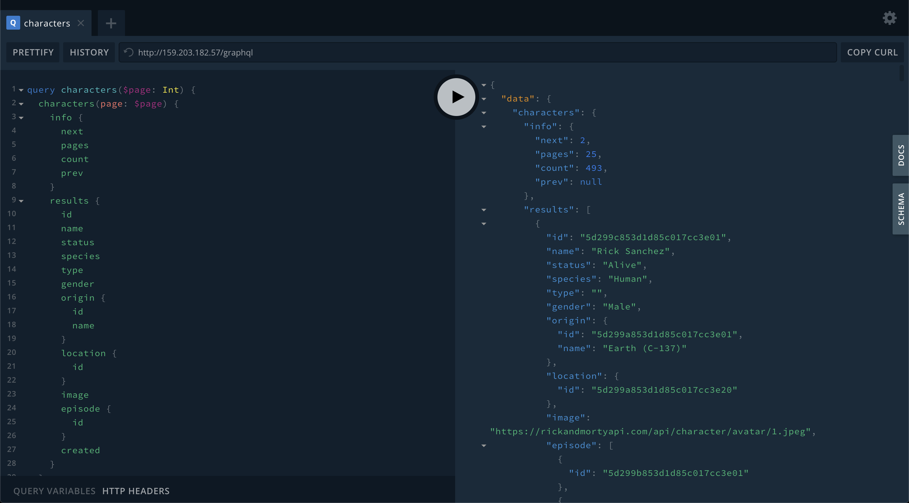

# Back end

## Rick and Morty GraphQL API

### [Demo](http://rickandmorty.blockchainacademy.mx/graphql)



## Descripción

El reto consiste en crear una API en GraphQL con Apollo Server, Express, Node y MongoDB. Se busca implementar conceptos de manejo de datos, populación, filtrado y desarrollo de esquemas tanto para GraphQL y MongoDB con Mongoose.

## Objetivo

El API debe proveer un endpoint para acceder a todos los datos de Rick and Morty bajo el estándar de GraphQL, y utilizando [Apollo Server](https://www.apollographql.com/docs/apollo-server/), [Express](https://expressjs.com/es/) y el ODM de MongoDB: [mongoose](https://mongoosejs.com/).

Los datos que sirva el API deberán tener la capacidad de ser `populados` a **1 nivel de profundidad** _\(ver definición de profundidad en el Apéndice\)_**,** es decir, que al hacer queries a profundidad entre schemas, sólo se pueda acceder al siguiente schema inmediato.

La aplicación deberá además sólo proveer datos de lectura, por lo que no se contemplan los casos de creación, edición y eliminación. \(CRUD Operations\). Aunque de agregarse, serán considerados como puntos extras.

Los datos semilla \(seeders\) se proveen en esta misma guía, y deberán ser plantados en la base de datos con scripts de seeding y dropping, que también serán evaluados

### Seeders

Estos son los datos que la API debe proveer y administrar. Se proporcionan completos, con todas las relaciones construidas y los IDS correctamente colocados, probados previamente. Es trabajo del candidato interpretar estos datos y colocarlos en la API.







## Queries requeridas

### characters\(page: Int\): Characters!

Request que trae todos los personajes de la base de datos, separados en páginas de 20 personajes.

| Parámetros | Tipo |
| :--- | :--- |
| page | Int |

Ejemplo para probar esta query

```graphql
query characters {
  characters(page: 2) {
    info {
      next
      pages
      count
      prev
    }
    results {
      id	
      name
      status
      species
      type
      gender
      origin {
        id
        name
      }
      location {
        id
      }
      image
      episode {
        id
      }
      created
    }
  }
}
```

#### Resultado



### character\(id: ID!\): Character

Request que trae un sólo personaje de la base de datos, utilizando su ID

| Parámetros | Tipo |
| :--- | :--- |
| id | ID! |

Ejemplo para probar esta query

```graphql
query character {
  character(id: "5d299c853d1d85c017cc3e01") {
    id
    origin {
      name
    }
    location {
      name
    }
    image
    created
  }
}
```

#### Resultado



### episodes\(page: Int\): Episodes!

Request que trae todos los episodios de la base de datos, separados en páginas de 20 episodios.

| Parámetros | Tipo |
| :--- | :--- |
| page | Int |

Ejemplo para probar esta query

```graphql
query episodes{
  episodes(page: 1) {
     info {
      next
      pages
      count
      prev
    }
    results {
      id	
      name
      air_date
      episode
      characters {
        id
        name
      }
      created
    }
  }
}
```

#### Resultado



### episode\(id: ID!\): Episode

Request que trae un sólo episodio de la base de datos, utilizando su ID

| Parámetros | Tipo |
| :--- | :--- |
| id | ID! |

Ejemplo para probar esta query

```graphql
query episode {
  episode(id: "5d299b853d1d85c017cc3e03") {
    id
    name
    air_date
    episode
    characters {
      id
      name
    }
    created
  }
}
```

#### Resultado



### locations\(page: Int\): Locations!

Request que trae todas ubicaciones de la base de datos, separadas en páginas de 20 ubicaciones.

| Parámetros | Tipo |
| :--- | :--- |
| page | Int |

Ejemplo para probar esta query

```graphql
query locations {
  locations(page: 3) {
     info {
      next
      pages
      count
      prev
    }
    results {
      id
      name
      name
      type
      dimension
      residents {
        id
      }
      created
    }
  }
}
```

#### Resultado



### location\(id: ID!\): Location

Request que trae una sola ubicación de la base de datos, utilizando su ID

| Parámetros | Tipo |
| :--- | :--- |
| id | ID! |

Ejemplo para probar esta query

```graphql
query location {
  location(id: "5d299a853d1d85c017cc3e52") {
    id
    name
    name
    type
    dimension
    residents {
      id
    }
    created
  }
}
```

#### Resultado



## Despliegue

La aplicación deberá ser colocada en el Droplet oficial del challenge de Blockchain Academy, cuya IP es [174.138.41.192](http://174.138.41.192)

### Accesos

Se realizará por SSH, y se deberá solicitar a un miembro del equipo de BAM el registro de las credenciales SSH del candidato para acceder al droplet.

### Ubicación de los archivos

Deberán ser colocados en el siguiente directorio:

```text
~/<tu-nombre>-challenge
```

Ahí dentro se deberá correr el proyecto, en el puerto que el candidato desee, sólo verificar que no esté siendo utilizado previamente por otro candidato.

### Base de datos

Para administrar correctamente las bases de datos de los candidatos, deberás usar una URI para mongoDB personalizada, con el siguiente formato:

```text
MONGODB_URI=mongodb://localhost/rickandmorty-<tu-nombre>
```


Es importante que mantengas este formato, para poder ubicar correctamente tus datos.



Mucho cuidado con sobreescribir la base de datos de alguien más


### Ejecución en segundo plano

El droplet ya tiene cargado PM2, para administrar procesos en segundo plano. Para ello, en el root de tu aplicación, se deberá correr:

```text
pm2 start "<tu-script-de-inicio>" --name "<tu-nombre>"
```

Ello creará un proceso corriendo con tu nombre, puedes verificarlo haciendo:

```text
pm2 ls
```

Con ello mostrarás todos los procesos corriendo con pm2 en el droplet.

Puedes obtener más información de PM2 [aquí](https://www.npmjs.com/package/pm2).


Es importante no alterar los procesos de los retos de otros candidatos. Si se realiza un movimiento sobre archivos de otro candidato, será fuertemente penalizado.


## Limitaciones

* La API deberá estar forzonamente en GraphQL
* El paginado y la información para las queries de más de un documento son obligatorios

## Puntos a evaluar

* Schemas con Mongoose
* Schemas con GraphQL
* Setup del API
* Uso de los seeders
* Estructura de resolvers y typedefs para el API
* Similitud con el API original de Rick and Morty
* Paginación e información de las queries
* Despliegue en el droplet

## Recomendaciones

* Intenta aventurarte a realizar un CRUD completo, eso sería increíble.
* No te limites a los parámetros solicitados en cada query. Si puedes añadir filtros de búsqueda o queries personalizadas, será tomado en cuenta.
* Coloca el puerto de express y la dirección de tu  base de datos en un archivo .env
* En caso de que hayas realizado previamente el challenge de front-end, asegúrate de que esta API sea compatible con tu aplicación en React para que puedas conectarlas

## Apéndice

### Query a profundidad

Le denominamos profundidad a la cantidad de schemas que recorre una query hacia adentro. Es decir, la cantidad de veces que la base de datos tiene que poblar una entidad. Por ejemplo:

```text
Character -> Location -> Residents -> Location
```

La anterior, sería una query con 3 grados de profundidad, ya que se pide al personaje \(grado 0\), y de dicho personaje se obtiene su ubicación \(grado 1\), de la que se obtienen los residentes \(grado 2\), y así sucesivamente.

#### Ejemplo de queries válidas e inválidas:

Dados los siguientes schemas de datos para personaje y ubicación:

```graphql
type Character {
  ...
  location: Location
  ...
}

type Location {
  ...
  residents: [Character]
  ..
}
```

Las siguientes queries serán validas:

```graphql
query characters {
  characters {
      location {
        ...
        name
        ...
      }
  }
}
```

```text
query locations {
  locations {
      residents {
        ...
        name
        ...
      }
  }
}
```

Sin embargo, queries con un nivel secundario de profundidad, como la siguiente **no deberán ser validas**:

```graphql
query characters {
  characters {
      location {
        ...
        residents {
          ...
          name
          ...
        }  
        ...
      }
  }
}
```

